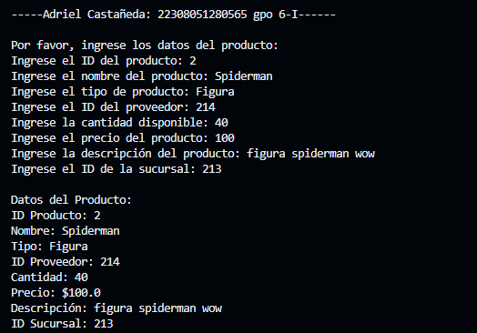
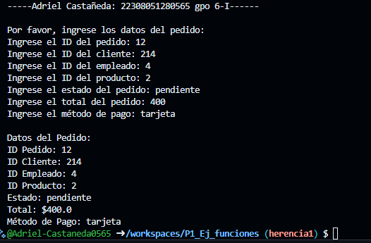

# Productos
* crear la clase Productos con los atributos (id_prod, nombre, tipo, id_prov,cantidad, precio, descripsion,id_sucursal) con una función capturadatos(), con interacción de interfaz de usuario. Crear la clase DatosProducto con herencia Productos y una función MostrarDatos()
* 

# Pedido
* crear la clase Pedido con los atributos (id_pedido,id_cliente,id_empleado,id_producto,estado,total,metodo_pago) con una función capturadatos(), con interacción de interfaz de usuario. Crear la clase DatosPedido con herencia Pedido y una función MostrarDatos()
* 
