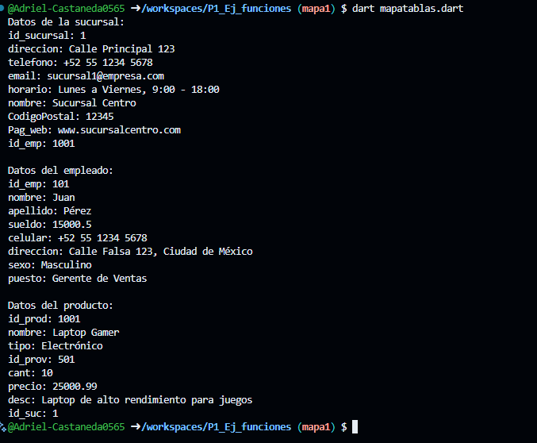

# Instrucciones
- crear map <string, dynamic> sucursal con los siguientes key, id_sucursal, direccion. telefono, email, horario, nombre, CodigoPostal, Pag_web, id_emp . y mostrar los datos con un forEach. lenguaje dart

- crear map <string, dynamic> empleado con los siguientes key, id_emp, nombre, apellido, sueldo, celular, direccion, sexo, puesto . y mostrar los datos con un forEach. lenguaje dart

- crear map <string, dynamic> producto con los siguientes key,id_prod, nombre, tipo, id_prov, cant, precio, desc, id_suc . y mostrar los datos con un forEach. lenguaje dart

# Salida de datos
- 