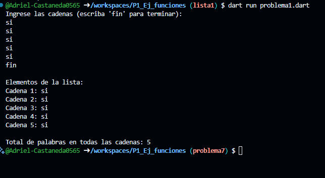

* Implementa un programa que tome una lista de cadenas (string) y cuente cuántas palabras hay en total en todas las cadenas. que utilice 2 funciones una para capturar datos de la lista y otra para mostrar los elementos en lenguaje dart

* resultados
- 